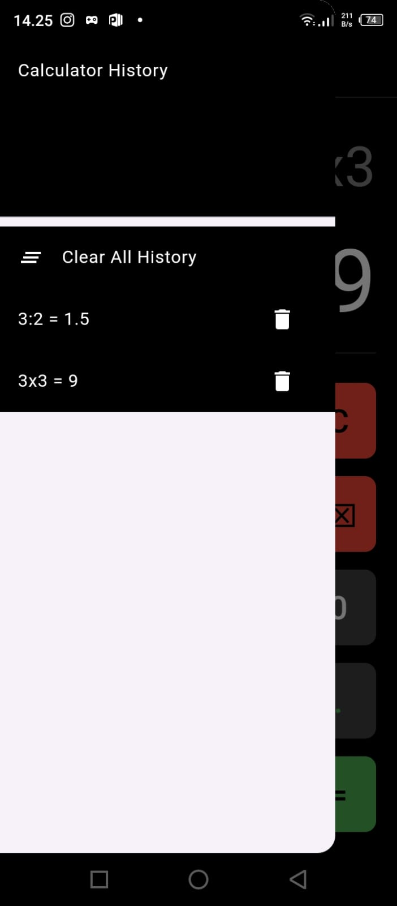
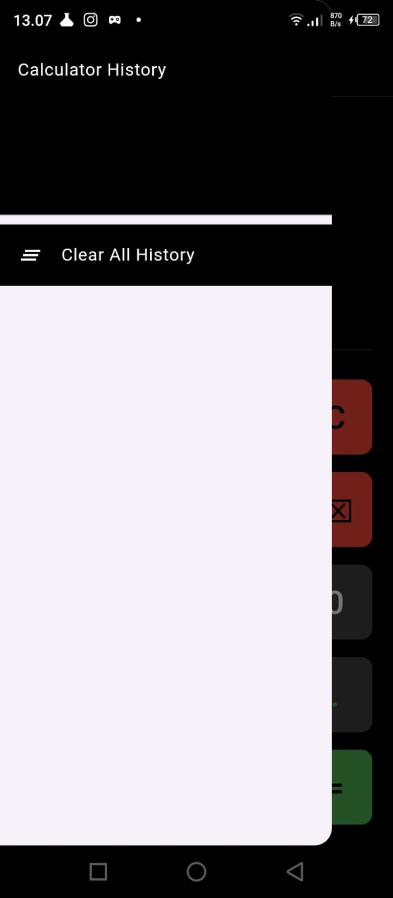
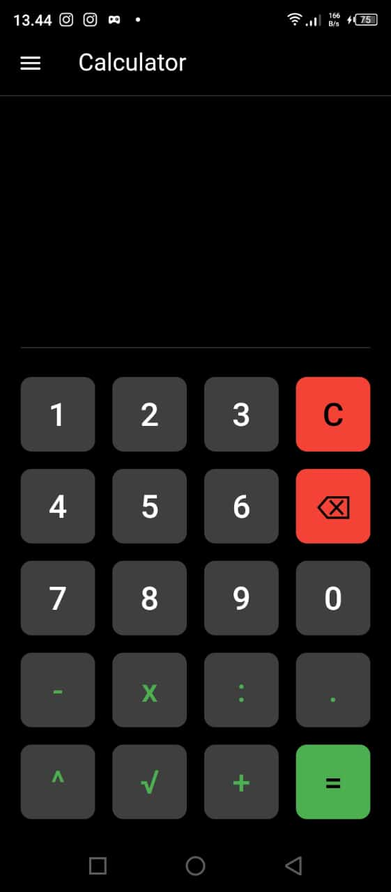
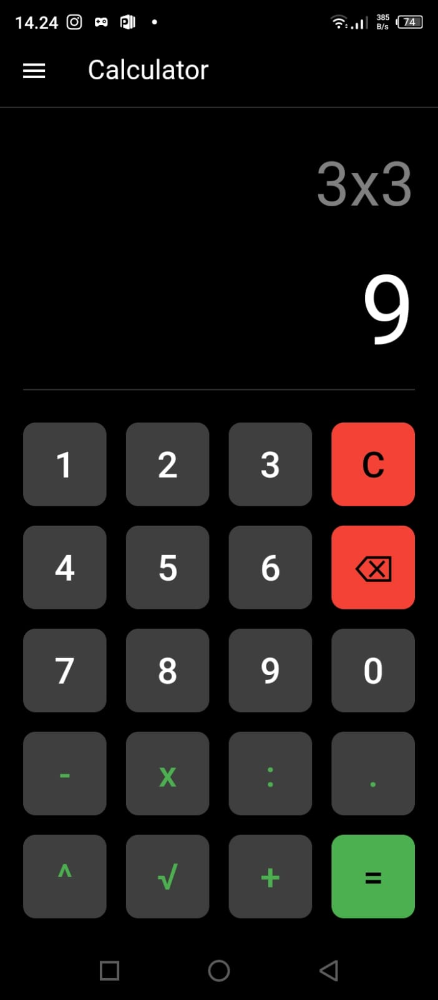

# calculator

Project Portofolio Kalkulator dengan History hasil belajar Flutter

Fitur :
- Pengurangan
- Penjumlahan
- Pembagian
- Perkalian
- Perpangkatan
- Akar Pangkat
- Bilangan Desimal
- History (Database Local SQLlite)
- Hapus History

